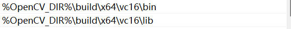
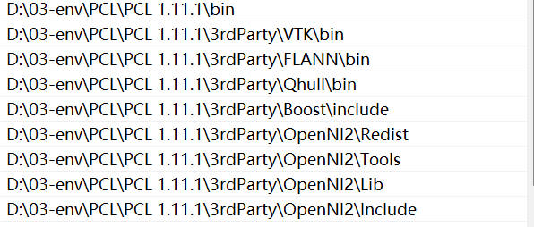

## 目录

- basic
- visualize
- file_operate
- search
- filter/sample
- features
- ransac
- fit/detect
- registration
- segmentation
- reconstruct
- compression
- callback
- range_image

## 环境配置

添加 pcl opencv 到系统路径





运行路径在 xx\learn\ 下执行程序，这样才能读取到 点云文件

## my_functions.h

```cpp

print_args(); // 打印

visualizeCloud(); // 通过重载 支持 PointXYZ PointXYZRGB 可视化

loadPCD_(); // 通过路径加载 pcd 格式点云

```
